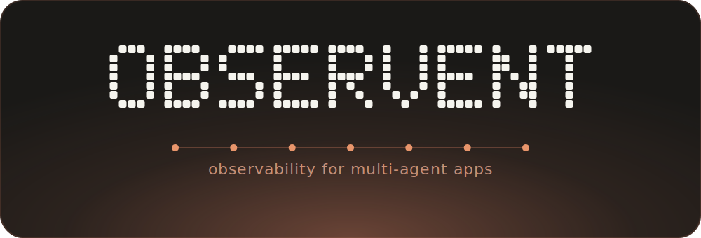

<p align="center">
  
</p>

<p align="center">
  <b>Production-grade observability for multi-agent Python apps — in one command.</b>
</p>

<p align="center">
  <a href="LICENSE"></a>
  
  <a href=".github/workflows/ci.yml"></a>
  
  <a href="https://skills.sh/HemachandranD/observent"></a>
</p>

<p align="center">
  8 frameworks &times; 5 backends &middot; correct span hierarchy &middot; context propagation &middot; cost columns that aren&rsquo;t&nbsp;$0
</p>

---

**observent** wires up production-grade observability for multi-agent Python apps. It detects your agent framework, generates the right integration code for the backend you pick, and enforces the span attributes and context-propagation patterns that make multi-agent traces actually useful — across **8 frameworks × 5 backends**, in Claude Code and 70+ other coding agents. One command, a diff to approve, and your traces map to your agent topology with real costs attached.

## Install via — `npx skills`

Supports **OpenCode**, **Claude Code**, **Codex**, **Cursor**, and [68 more](#supported-agents).

```bash
npx skills add HemachandranD/observent
```

`npx skills` auto-detects the coding agents installed on your machine and copies the self-contained `observent` skill into each one's skills directory. `references/` and `scripts/` travel inside the skill folder, so there are no environment variables to set and nothing to keep in sync. To remove it, run `npx skills` again (or delete the skill folder from the agent's skills directory).

### Options

| Flag | Effect |
|---|---|
| `--list` | Show the skill without installing |
| `-a <agent>` | Target specific agents — repeatable, e.g. `-a cursor -a cline` |
| `-g` | Install into your home directory instead of the project |
| `-y` | Skip prompts |

### Claude Code (plugin)

```bash
claude plugin install HemachandranD/observent
```

Adds three slash commands: `/observent`, `/observent-detect`, `/observent-validate`. Prefer the skill-only install? `npx skills add HemachandranD/observent -a claude-code` drops it into `.claude/skills/` instead — same workflow, no slash commands.

## Try it

### Claude Code

```
/observent
/observent langgraph phoenix
/observent crewai langfuse
/observent microsoft-agent-framework signoz
/observent openai-agents phoenix
/observent anthropic-agents langfuse
/observent llama-index signoz
/observent smolagents langfuse
/observent custom phoenix
/observent microsoft-agent-framework elastic-apm
/observent langgraph langsmith

# Multi-backend fan-out — second arg accepts a comma-separated list:
/observent langgraph phoenix,signoz
/observent langgraph phoenix,langsmith
/observent crewai phoenix,langfuse,signoz,elastic-apm,langsmith

/observent-detect                                # run detectors and report what's installed
/observent-validate phoenix [--smoke-test]       # single backend
/observent-validate phoenix,signoz --smoke-test  # multi-backend
```

The convention emitted by generated code is **mechanically resolved from the chosen backend set** — Phoenix → OpenInference; Langfuse / SigNoz / Elastic APM / LangSmith → OpenTelemetry GenAI; mixed (Phoenix + at least one of Langfuse / SigNoz / Elastic APM / LangSmith) → both. There's no runtime override; to switch conventions, re-run `/observent` with a different backend(s).

### Cursor / Codex / GitHub Copilot / Windsurf / Antigravity/ Cline / 

Ask your agent to set up observability. For example:

> "Add LLM tracing to this project with Arize Phoenix"
> "Wire up Langfuse observability for this CrewAI app"
> "Set up SigNoz monitoring for my agent"

The `observent` skill — installed into the agent's skills directory by `npx skills` — is loaded on demand and runs the full workflow from its own `SKILL.md`. This works identically from each tool's **CLI** and **IDE**.

---

## Supported frameworks × backends

| Framework | Arize Phoenix | Langfuse | SigNoz | Elastic APM | LangSmith |
|---|:---:|:---:|:---:|:---:|:---:|
| LangGraph | ✓ | ✓ | ✓ | ✓ | ✓ |
| CrewAI | ✓ | ✓ | ✓ | ✓ | ✓ |
| Microsoft Agent Framework (`agent-framework`) | ✓ | ✓ | ✓ | ✓ | ✓ |
| Anthropic Agents SDK | ✓ | ✓ | ✓ | ✓ | ✓ |
| OpenAI Agents SDK *(native trace processor)* | ✓ | ✓ | ✓ | ✓ | ✓ |
| smolagents | ✓ | ✓ | ✓ | ✓ | ✓ |
| LlamaIndex | ✓ | ✓ | ✓ | ✓ | ✓ |
| Custom (no framework) | ✓ | ✓ | ✓ | ✓ | ✓ |

Elastic APM uses the native `elastic-apm` Python agent by default (its OTel bridge picks up the OpenInference instrumentors), giving you transaction tracing and infrastructure metrics in Kibana alongside LLM spans. LangSmith uses pure OTLP HTTP to its OTel ingest endpoint (cloud US/EU or enterprise self-host) with OTel-GenAI conventions on the wire — no `langsmith` SDK code is generated. Microsoft Agent Framework uses its built-in OpenTelemetry support — observent layers `OpenAIInstrumentor` on top for raw model-call spans. observent does not support AutoGen (v0.2 `pyautogen` or v0.4 `autogen-agentchat`) — Microsoft has unified AutoGen and Semantic Kernel into `agent-framework`; migrate to MAF or use the Custom path.

## Supported providers

| Provider | How observent runs | Install |
|---|---|---|
| **Claude Code** | Plugin — `/observent`, `/observent-detect`, `/observent-validate` slash commands. (Or skill-only via npx skills.) | `claude plugin install HemachandranD/observent` |
| **Cursor · Windsurf · Cline · GitHub Copilot · OpenAI Codex · Google Antigravity** (CLI + IDE) | The `observent` skill is loaded from the agent's own skills directory | `npx skills add HemachandranD/observent` |

> **Single source of truth:** the full workflow lives in `skills/observent/SKILL.md`, alongside its `references/` and `scripts/`. [`npx skills`](https://github.com/vercel-labs/skills) (vercel-labs/skills) copies that **self-contained** skill folder into each detected agent's skills directory (`.claude/skills/`, `.agents/skills/`, …) — auto-detecting which of 70+ coding agents you have installed. No per-tool rule files, no `AGENTS.md` mirror to keep in sync.
>
> **Claude Code gets a choice:** the native plugin (above) adds the `/observent*` slash commands; `npx skills add HemachandranD/observent -a claude-code` installs the same skill into `.claude/skills/` without the slash commands. Both run the identical workflow.

## Supported agents

`npx skills` installs `observent` into any of the **70+ coding agents** it detects — the skill folder is self-contained, so it runs identically everywhere. Common ones:

| Agent | `-a` value |
|---|---|
| Claude Code | `claude-code` |
| Cursor | `cursor` |
| Windsurf | `windsurf` |
| Cline | `cline` |
| GitHub Copilot | `copilot` |
| OpenAI Codex | `codex` |
| Google Antigravity | `antigravity` |
| OpenCode | `opencode` |

…and 60+ more. Run `npx skills add HemachandranD/observent --list` to see every agent detected on your machine; each agent's exact skills directory is resolved automatically. The [vercel-labs/skills agent table](https://github.com/vercel-labs/skills#supported-agents) is the canonical list with per-agent install paths.

---

## Why observent

- **One command, correct the first time.** No hand-rolling OTel boilerplate across 40 framework × backend combinations and praying you got the attribute keys right.
- **Multi-agent-aware, not generic LLM tracing.** The span tree mirrors your topology (`Crew → Agent → LLM`, `Workflow → Step → Tool`); handoffs, sessions, and tool calls are first-class spans — not flat noise.
- **Cost columns that aren't $0.** Model, provider, prompt + completion + cache tokens, tool calls, and finish reasons are mandatory in every generated template, so your backend's cost view actually populates.
- **The right convention, derived — not guessed.** Phoenix → OpenInference, Langfuse / SigNoz / Elastic APM / LangSmith → OpenTelemetry GenAI, mixed → both. Mechanically resolved from the backends you pick; no flags to fumble.
- **Works in 70+ coding agents, not just Claude Code.** The same skill ships to Cursor, Windsurf, Cline, Copilot, Codex, Antigravity, and the rest via [`npx skills`](https://github.com/vercel-labs/skills) — one source of truth, zero per-tool config.
- **Safe by construction.** Diff preview before every edit, even when auto-invoked. Spec-driven and resumable across sessions. It writes a `.env.example` — never your real secrets.
- **Local backends in one step.** Pick a self-host backend that isn't running and observent offers to stand it up with a pinned Docker stack — Phoenix, Langfuse, SigNoz, Elastic APM — behind a double opt-in.
- **Zero-dependency core.** Detection and validation run on the Python standard library; the whole skill works with nothing but `Bash`. MCPs, when present, only *add* confidence — they're never required.

## What a useful multi-agent trace actually needs

observent bakes all of this into the code it generates:

- **Span hierarchy** — `Crew → Agent → LLM call`, `Workflow → Step → Tool` — so the trace tree maps to your agent topology.
- **Handoff visibility** — agent-to-agent transfers (OpenAI Agents SDK, Microsoft Agent Framework) as first-class spans.
- **Identity attributes** — `agent.name`, `agent.role`, `agent.framework` on every span for filtering.
- **Session grouping** — multi-turn conversations grouped under one `session.id`.
- **Mandatory attributes** — model, provider, prompt + completion + cache tokens, tool calls, finish reasons — captured per the convention each backend prefers (OpenInference for Phoenix, OpenTelemetry GenAI for Langfuse / SigNoz / Elastic APM / LangSmith; both when fanning out across Phoenix and any of them) so cost columns aren't $0.
- **Context propagation** — across async, threads, subprocesses, and HTTP boundaries.

## How it works

1. **Detect** your framework and any pre-existing observability config.
2. **Preview** a diff of every change it will make — nothing is written silently.
3. **Generate** the integration code after you approve, list the `pip install` command, and produce a `.env.example`.
4. **Validate** the setup (and optionally emit a synthetic span to confirm end-to-end ingestion).

Under the hood it's a spec-driven lifecycle (Spec → Plan → Tasks → Implement) that persists its state in `.observent/` in your project, so a run interrupted by a session break resumes exactly where it stopped.

## What it generates

For e.g. `langgraph` + `phoenix`, you get:

- A few lines added to your entry point that initialise Phoenix and register the LangChain instrumentor.
- An `.env.example` with `PHOENIX_PROJECT_NAME` (and `PHOENIX_API_KEY` for cloud).
- A `pip install` command pinned to known-good minimum versions.
- Span attributes following the convention resolved from your backend(s) — OpenInference for Phoenix, OTel-GenAI for Langfuse / SigNoz / Elastic APM / LangSmith, both when fanning out across Phoenix and any of them.

For Elastic APM, you get the 3-line native-agent setup (`elasticapm.Client(...)` + `elasticapm.instrument()`) with the framework instrumentor on top — Kibana's APM UI then shows transaction spans, auto-instrumented infra metrics, and LLM spans together. For LangSmith, you get a pure-OTLP `OTLPSpanExporter` block parameterized by `LANGSMITH_API_KEY` (+ optional `LANGSMITH_ENDPOINT` and `LANGSMITH_PROJECT`) — no `langsmith` SDK code, so it composes cleanly into the multi-backend fan-out. For multi-backend fan-out (e.g. `phoenix,elastic-apm` or `phoenix,langsmith`), you get a single `TracerProvider` with one `BatchSpanProcessor` per OTLP backend plus the `elasticapm.Client` next to it (if Elastic is in the set); each path exports independently.

For `Custom`, it also writes an `observent_otel.py` helper with typed setters: `with_agent_span()`, `set_llm_attrs()`, `set_tool_attrs()`. The resolved convention is written into the helper as a module-level literal (`_CONVENTION = "oi"` / `"otel-genai"` / `"both"`) at generation time — no env var, no runtime override.

### Local backends

If you pick a self-host backend that isn't already running and Docker is available, observent can spin it up locally — Phoenix, Langfuse, SigNoz, and Elastic APM each get a pinned Docker stack (a generated `docker-compose.observent-<backend>.yml` for Phoenix/Elastic, a pinned upstream clone for Langfuse/SigNoz).

**It never builds or starts a container without asking — twice:**

1. **Opt-in offer.** When a chosen self-host backend is detected unreachable, observent asks `Provision it locally with Docker? (yes / no, I'll start it myself / skip)`. Decline and no Docker task is created at all.
2. **Confirm before it runs.** Even after you opt in, the exact `docker compose … up -d --wait` command (and, for Phoenix/Elastic, the full generated compose file) appears in the diff preview, and nothing runs until you approve `Apply these changes?`. For Langfuse/SigNoz the preview shows the pinned `git clone … && docker compose up` command rather than the upstream compose contents.

You also get the matching `docker compose … down` command to tear the stack back down. **LangSmith** has no free OSS/Docker edition (self-host is enterprise-licensed), so observent points you at LangSmith Cloud or your licensed `LANGSMITH_ENDPOINT` instead of provisioning it.

## Repository structure

```
.claude-plugin/
  plugin.json           # Claude Code plugin manifest
  marketplace.json      # Marketplace listing — also declares the npx-skills
                        #   discovery path: plugins[0].skills = ["./skills/observent"]
commands/
  observent.toml          # /observent [framework] [backend|backend,...]
  observent-detect.toml   # /observent-detect
  observent-validate.toml # /observent-validate <backend|backend,...> [--smoke-test]
skills/observent/         # The skill folder npx skills installs into each agent
  SKILL.md              # Skill entry point (8-step workflow)
  references/
    matrix.md           # 8×3 matrix, span attrs, context propagation
    openinference.md    # Canonical OpenInference attribute reference
    otel_genai.md       # Canonical OTel-GenAI attribute reference
    examples.md         # 8 runnable end-to-end examples
    self_host.md        # Local-provisioning Docker stacks + image pins
  scripts/
    detect_framework.py # Detects installed frameworks/backends
    validate_setup.py   # Per-backend config + connectivity check
    existing_setup.py   # Detects pre-existing observability config
.github/workflows/ci.yml
```

## Contributing

Adding a framework or backend requires updates in five places — see `CLAUDE.md` for the ordered checklist.

Adding a new **provider** generally needs no repo change: cross-tool installation is handled by [`npx skills`](https://github.com/vercel-labs/skills), which already maps 70+ coding agents to their skills directories. As long as `skills/observent/SKILL.md` stays self-contained, a newly supported agent picks it up automatically. Add a row to the Supported providers table if you want to call it out explicitly.

CI validates plugin manifests (including the `skills` → `SKILL.md` discovery link), command TOML files, script imports, SKILL.md frontmatter, lint, and type-check on Ubuntu + Windows for Python 3.10 / 3.11 / 3.12.

## License

Apache-2.0 — see [LICENSE](LICENSE) and [NOTICE](NOTICE).
